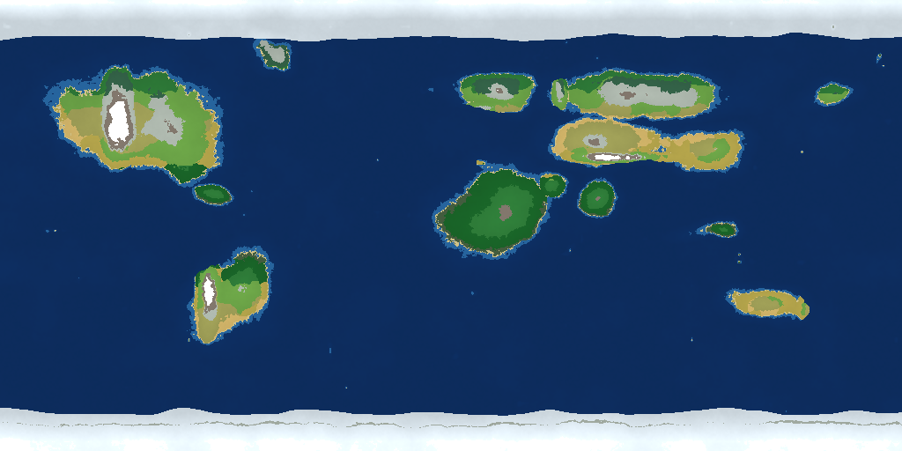

# World Generation — the whole earth



*Reference render of the generated planet (same algorithm, default seed): continents,
oceans, ice caps, deserts, rainforests and mountain ranges.*

The planet lives in `Assets/Scripts/World/WorldMap.cs`. Nothing about it is stored on
disk: any tile of the world can be sampled on demand, which is what makes a planet of
**16,384 × 8,192 tiles (134 million tiles)** possible on a phone.

## How a tile is decided

1. **Continents** — a set of normalised landmass "blobs" (North & South America,
   Greenland, Europe, Africa, Arabia, Siberia, Central Asia, India, East Asia,
   Sundaland, Australia, Beringia, plus polar caps) defines a base land mask.
2. **Coastline warping** — several octaves of fractal noise distort the mask so
   coastlines, bays, peninsulas and islands look natural.
3. **Mountain belts** — Rockies, Andes, Alps, Atlas, Himalaya, Urals and the Great
   Dividing Range are lifted with ridged noise.
4. **Climate** — temperature comes from latitude and altitude (with a lapse rate),
   moisture from Hadley-cell style banding plus noise and rain shadow.
5. **Rivers** — ridge noise carves rivers that widen as they descend to the sea.
6. **Biome** — the temperature/moisture/elevation triple is classified into one of
   15 biomes.

```csharp
var sample = WorldMap.Instance.Sample(x, y);
// sample.biome, sample.elevation, sample.temperature, sample.moisture, sample.isWater
```

## Streaming

`ChunkManager` keeps a square of chunks (`loadRadius`, default 3 → 7×7 chunks =
224×224 tiles) alive around the player. Each chunk:

* builds a ground tilemap and a water tilemap with `Tilemap.SetTiles` (one batched call),
* scatters trees / bushes / rocks using per-tile densities from the biome,
* is destroyed again as soon as the player walks out of range.

Chunks are built one per frame from a nearest-first queue, so walking never hitches.

## Content density

| Biome | Trees | Bushes | Rocks |
|-------|-------|--------|-------|
| Rainforest | 16% | 9% | 1.2% |
| Temperate forest | 13% | 7% | 1.2% |
| Taiga | 11% | 3% | 1.2% |
| Savannah | 2.5% | 4.5% | 1.2% |
| Grassland | 2% | 5% | 1.2% |
| Steppe | 0.6% | 2% | 2% |
| Tundra | 0.4% | 1% | 2% |
| Desert | 0.1% | 0.4% | 2% |
| Mountain | 1.5% | 1.2% | 6% |

Percentages are per tile, so a single forest chunk holds ~130 trees and the visible
world around the player holds thousands of props. Scale everything at once with
`ChunkManager.propDensity` (the Settings screen exposes Sparse / Normal / Lush).

## Wildlife

`AnimalSpawner` keeps up to 26 animals alive in a ring 26–55 units from the player,
picks species from the biome (herds of bison/mammoth, lone sabertooths and cave bears)
and despawns them past 95 units.

## Spawn point

A new game starts in East Africa — `WorldMap.FindSpawnTile()` searches outward for
temperate, non-mountain, reasonably moist land.

## Changing the planet

| What | Where |
|------|-------|
| Seed | `WorldMap.seed`, or `GameBootstrap.worldSeed` |
| Planet size | `WorldMap.worldWidth` / `worldHeight` |
| Sea level | `WorldMap.seaLevel` |
| Coastline detail | `WorldMap.coastRaggedness` |
| View distance | `ChunkManager.loadRadius` |
| Vegetation amount | `ChunkManager.propDensity` |
| Continent layout | the `Continents` table in `WorldMap.cs` |
